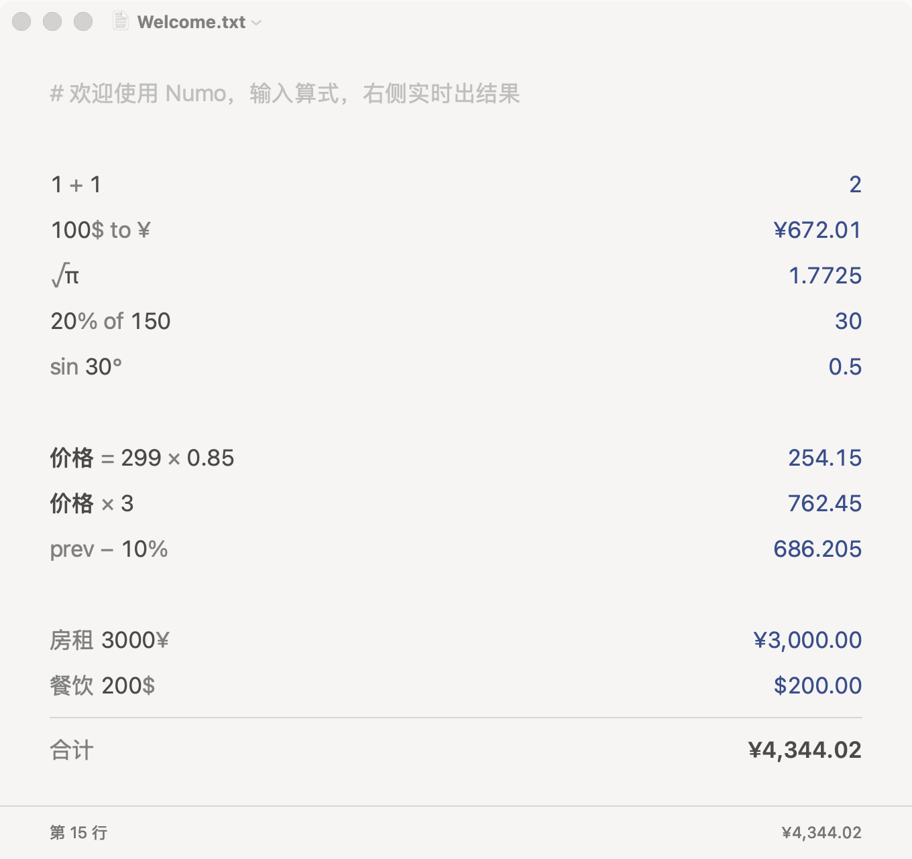
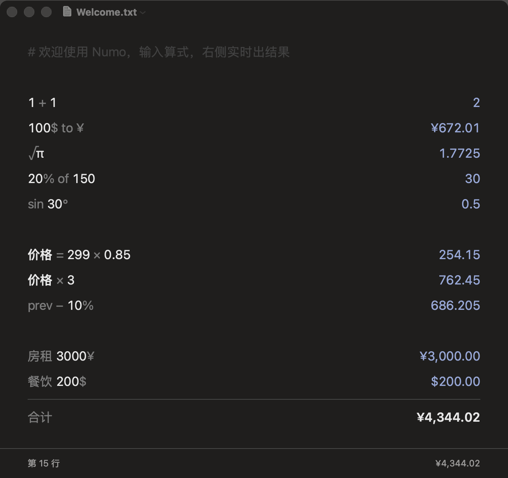
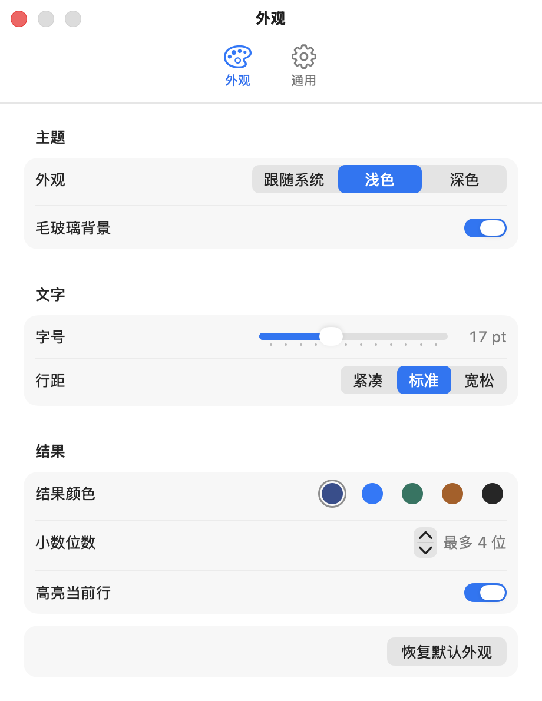

<div align="center">


# Numo

**A notepad calculator for macOS.** Write math as plain text, line by line — results appear instantly on the right.

English | [简体中文](README.zh-CN.md)

[](https://github.com/imelonkid/numo/actions/workflows/build.yml)
[](https://github.com/imelonkid/numo/releases)
[](LICENSE)


 

</div>

## ✨ Features

- **Instant results** — no "=" button, no Enter. Every line is evaluated as you type.
- **Exact decimals** — `0.1 + 0.2` is `0.3`, not `0.30000000000000004`.
- **Currency conversion** — `100$ to ¥`, `50 eur in usd`, `100美元换成人民币`, with live exchange rates cached for offline use.
- **Percentages that read naturally** — `20% of 150`, `200 + 10%`, `50 / 200 to %`.
- **Variables, `prev` and totals** — name intermediate values, reference the previous line, and sum a block with `sum` / `合计`.
- **Math functions** — `√`, `∛`, `sin 30°`, `log`, `ln`, `abs`, `round`, `5!`, `π`, `e`…
- **Plain-text notes** — every note is a `.txt` file, opened in tabs. Autosave, Open Recent, Rename, Revert — the macOS document model you already know.
- **Native and quiet** — AppKit, frosted glass, light/dark/auto themes, a restrained palette, and `⌥Space` to summon it from anywhere.

## 📦 Installation

1. Download the latest `Numo-x.y.z.dmg` from [**Releases**](https://github.com/imelonkid/numo/releases).
2. Open the DMG and drag **Numo** to **Applications**.
3. Numo is not notarized yet, so macOS blocks the first launch. Either go to **System Settings → Privacy & Security** and click **Open Anyway**, or run:

   ```bash
   xattr -dr com.apple.quarantine /Applications/Numo.app
   ```

Requires macOS 14 Sonoma or later (Apple silicon and Intel).

## 🚀 Syntax

| Category | Examples |
|---|---|
| Arithmetic | `1 + 2 × 3`, `(1 + 2) × 3`, `2 ^ 10`, `17 mod 5`, `5!`, `2(3 + 4)`, `1,000,000 ÷ 4`, `1.5e3` |
| Roots, constants, functions | `√16`, `∛27`, `2π`, `sin 30°`, `cos(π / 3)`, `log 1000`, `ln e`, `log2 1024`, `abs(−8)`, `round 3.6` |
| Percentages | `20% of 150`, `200 + 10%`, `200 − 25%`, `50 / 200 to %` |
| Currencies | `100$ to ¥`, `100 usd in eur`, `1$ = ¥`, `100美元换成人民币`, `50€ + 20$`, `1000 jpy to ¥` |
| Variables | `price = 299 × 0.85`, `price × 3`, `prev − 10%` |
| Radix & format | `0xFF + 0b1010`, `255 in hex`, `10 to bin`, `1234567 to sci` |
| Labels & totals | `Rent 3000¥`, `Food 200$`, then `sum` / `total` / `合计` (sums the block above, up to the previous blank line) |
| Comments | `# heading`, `1 + 1 // note` |

- `to`, `in`, `=`, `→` all mean "convert to". `¥` means CNY; write `jpy` / `日元` for yen.
- Typed `*` and `-` are shown as `×` and `−`. Full-width input (`１＋１`) works too.
- Plain numbers show up to 4 decimals by default (configurable); currencies use their own precision.
- The complete reference is built in: **Help → 语法速查** (`⌘?`).

## ⌨️ Shortcuts

| Shortcut | Action |
|---|---|
| `⌥ Space` | Show / hide Numo from anywhere |
| `⌘N` / `⌘O` | New note (tab) / open a note |
| `⌘S` / `⇧⌘S` | Save / Save As |
| Click a result, then `⌘C` | Copy a result (plain number, no grouping or symbol) |
| `⇧⌘C` | Copy the result of the current line |
| `⌘R` | Refresh exchange rates |
| `⌘,` | Settings |
| `⌘?` | Syntax reference |

## ⚙️ Settings



**Appearance** — follow system / light / dark, frosted glass, font size, line spacing, result color, decimal places, current-line highlight.

**General** — default save folder, reopen last notes on launch, exchange-rate status.

<br clear="right">

## 🛠 Build from source

Only the Swift 6 toolchain is required — Xcode or the Command Line Tools both work.

```bash
git clone https://github.com/imelonkid/numo.git
cd numo
scripts/test.sh          # run the NumoCore test suite
scripts/build-app.sh     # build build/Numo.app (ad-hoc signed)
scripts/make-dmg.sh      # package build/Numo-<version>.dmg
open build/Numo.app
```

Project layout:

```
Sources/NumoCore/   Calculation engine: Lexer → Pratt parser → Evaluator → Formatter (Decimal precision, no UI)
Sources/Numo/       AppKit app: editor and result column, documents & tabs, settings, rates, global hotkey
Tests/              swift-testing suite for NumoCore
scripts/            build, test, icon and DMG scripts
```

More in [docs/DEVELOPMENT.md](docs/DEVELOPMENT.md). Every push to `main` builds a DMG in [GitHub Actions](https://github.com/imelonkid/numo/actions); pushing a `v*` tag publishes it as a release.

## 🗺 Roadmap

- [ ] Physical units (`5 km to mi`, `1 GB in MB`)
- [ ] Date and time math (`today + 30 days`)
- [ ] Menu bar mode and a configurable global hotkey
- [ ] Code signing and notarization

## 🤝 Contributing

Issues and pull requests are welcome. Please run `scripts/test.sh` before submitting, and add tests in `Tests/NumoCoreTests` for new syntax.

## 📄 License

[MIT](LICENSE) © melonkid

## 🙏 Acknowledgements

Inspired by [Numi](https://numi.app) and [Soulver](https://soulver.app). Exchange rates by [ExchangeRate-API](https://www.exchangerate-api.com) (open.er-api.com).
